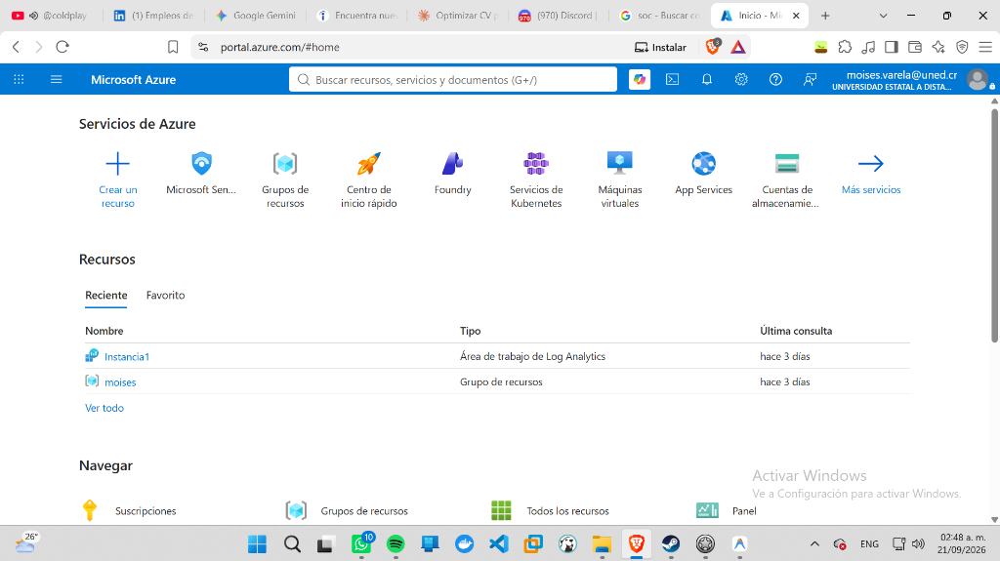
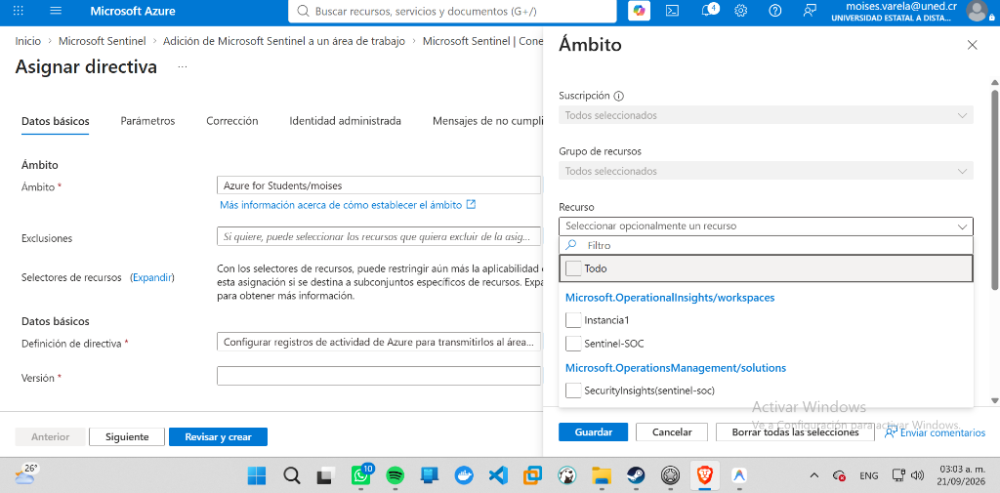
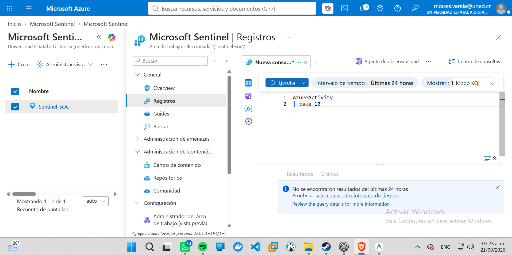
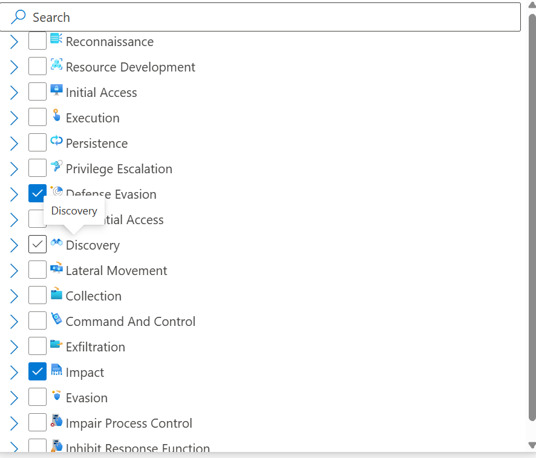
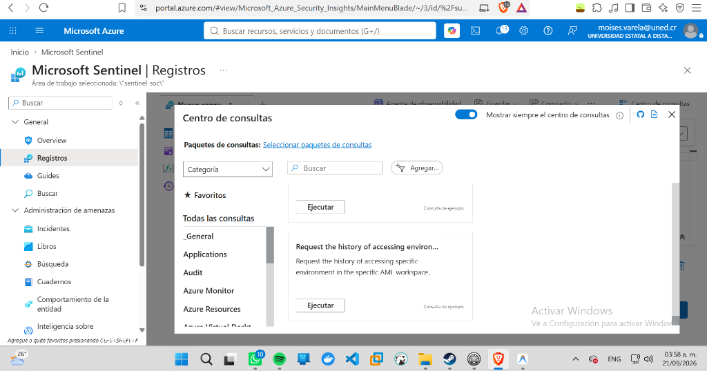
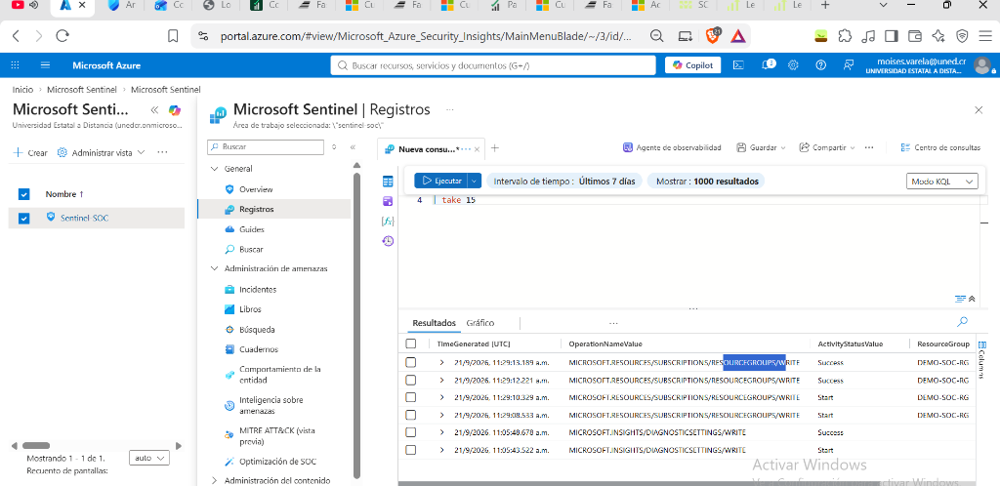

# 🧪 Lab 01: Microsoft Sentinel SIEM Architecture & Cloud Detection Engineering

> **Core Competencies:** Cloud Telemetry Ingestion | Azure Log Analytics | Diagnostic Settings | KQL Detection Engineering | Entity Mapping | Alert Grouping | Incident Graph Investigation

---

## 1. Project Overview & Architecture

This lab establishes the foundational telemetry and detection fabric in **Microsoft Sentinel**, capturing subscription-level control-plane activity from the Azure Resource Manager (ARM), routing audit logs through Diagnostic Settings into a Log Analytics Workspace, and deploying automated detection rules to identify administrative tampering and unauthorized resource destruction.

```
[ Azure Resource Manager (ARM) ]
                │
                ▼ (Diagnostic Settings: "Administrative" & "Security")
[ Log Analytics Workspace: "Sentinel-SOC" ]
                │ (Table: AzureActivity)
                ▼
[ Microsoft Sentinel Analytics Engine ]
                │ (Scheduled Rule: 5m frequency, 24h lookback)
                ▼
[ Correlated Security Incident & Investigation Graph ]
```

---

## 2. Implementation Walkthrough & Forensic Evidence

### Step 1: Sentinel Workspace Provisioning
Created and initialized the centralized Log Analytics workspace `Sentinel-SOC` in region North Central US, onboarding Microsoft Sentinel as the cloud-native SIEM/SOAR platform.


*Figure 1.1: Provisioning the Log Analytics Workspace and Microsoft Sentinel instance.*

---

### Step 2: Diagnostic Settings & Telemetry Pipeline
Configured Azure Subscription Diagnostic Settings (`Enviar-a-Sentinel`) to stream audit events into `Sentinel-SOC`. Categories collected include:
* **Administrative:** User and service principal control-plane operations.
* **Security:** Security alerts and posture evaluations.
* **Alert & Policy:** Compliance and policy enforcement events.


*Figure 1.2: Configuring Azure Subscription Diagnostic Settings to route audit logs to Sentinel-SOC.*

---

### Step 3: Verifying Telemetry Ingestion (AzureActivity)
Audited raw event streaming within the `AzureActivity` table using KQL to validate schema consistency, caller identity attribution, and operation latency:

```kql
AzureActivity
| where TimeGenerated > ago(24h)
| summarize EventCount = count() by OperationNameValue, ActivityStatusValue
| sort by EventCount desc
```


*Figure 1.3: Real-time telemetry ingestion into the AzureActivity table.*

---

### Step 4: Analytic Rule Engineering (Resource Deletion & Sabotage)
Engineered a custom scheduled analytic rule to detect unauthorized destructive activity (MITRE T1485 - Data Destruction, T1562.001 - Impair Defenses):

* **Rule Name:** `SOC - Suspicious Resource Deletion or Administrative Activity`
* **Severity:** Medium
* **Query Frequency:** Every 5 minutes (Lookback: 24 hours)
* **KQL Logic:**
  ```kql
  AzureActivity
  | where OperationNameValue has "delete"
  | where ActivityStatusValue in~ ("Success", "Succeeded")
  | project TimeGenerated, Caller, CallerIpAddress, OperationNameValue, ResourceGroup, Resource
  ```
* **Entity Mapping:**
  * `Account` ➔ `Caller` (UPN / Name)
  * `IP` ➔ `CallerIpAddress` (Address)
* **Alert Grouping:** Configured 5-hour window grouping on matching Account + IP to consolidate burst operations and eliminate SOC alert fatigue.


*Figure 1.4: Scheduled analytic rule configuration with entity mapping and alert grouping.*

---

### Step 5: Incident Generation & Alert Grouping Validation
Simulated an administrative tampering burst by rapidly provisioning and deleting decoy resource groups (`ciber-test-1`, `ciber-test-2`). The rule successfully fired, grouped individual delete events into a single consolidated incident, and prevented duplicate ticket flooding.


*Figure 1.5: Incident generated in Microsoft Sentinel with grouped alerts.*

---

### Step 6: Investigation Graph & Entity Triangulation
Leveraged Microsoft Sentinel's visual Investigation Graph to pivot between the identity entity (`Caller`), the source network entity (`CallerIpAddress`), and the impacted cloud infrastructure (`ResourceGroup`).


*Figure 1.6: Interactive investigation graph correlating the caller identity, originating IP, and affected resources.*

---

## 3. Key Technical Takeaways (SC-200 Exam & Enterprise Operations)
1. **Diagnostic Settings Routing:** Subscription-level events must be explicitly routed via Diagnostic Settings to populate `AzureActivity`; they are not forwarded to Log Analytics by default.
2. **Alert Fatigue Prevention:** Unmitigated deletion rules fire a separate alert for every resource sub-component. Configuring Entity Grouping (Account + IP over 5h) reduces alert noise by over 90%.
3. **Entity Mapping Importance:** Without proper entity mapping, Sentinel incidents cannot populate investigation graphs or integrate with SOAR playbooks.
