# 🛡️ Lab 02: Enterprise Threat Hunting, Detection Engineering, SOAR & Live Day-0 Incident Triage

> **Core Competencies:** Advanced KQL Hunting | Multi-Signal Detection Engineering | Logic App SOAR Playbooks | System-Assigned Managed Identity | Azure RBAC Governance | MITRE ATT&CK Mapping | Live Threat Actor Triage | Responsible Disclosure

---

## 1. Executive Summary & STAR Narrative

### Situation
While configuring advanced identity threat detection rules in Microsoft Sentinel within an educational cloud tenant, the SIEM began streaming high-severity security alerts reflecting active, live-fire intrusion attempts against organizational accounts.

### Task
Validate whether the telemetry reflected false-positive noise or an active breach. Reconstruct the entire kill chain across all available data providers (Entra ID Protection, Microsoft Defender XDR, Defender for Cloud Apps), engineer automated response controls to triage incoming incidents, and compile an actionable forensic advisory for the institution's Incident Response team.

### Action
1. **Engineered Multi-Signal Detection Rules:** Built Near-Real-Time (NRT) and Scheduled correlation rules to isolate credential spray attacks and group multi-vector alerts.
2. **Automated Triage via SOAR:** Deployed an Azure Logic App playbook utilizing a System-Assigned Managed Identity with `Microsoft Sentinel Responder` RBAC permissions, tied to a Sentinel Automation Rule.
3. **Executed Deep KQL Threat Hunting:** Extracted attacker infrastructure across 20+ countries, cataloged 34 confirmed compromised identities (anonymized via SHA-256), discovered Day-0 persistence backdoors in Azure AD Enterprise Applications, and uncovered malware staging in institutional OneDrive repositories.
4. **Coordinated Responsible Disclosure:** Authored and transmitted a structured security advisory to the institution's Digital Security Unit detailing active IoCs, compromised accounts, and containment steps.

### Result
* **384 correlated alerts** categorized across 6 MITRE ATT&CK tactical stages.
* **34 confirmed compromised accounts** and **8 Azure AD Service Principal backdoors** isolated and reported.
* **End-to-end automated triage pipeline** active in Microsoft Sentinel.

---

## 2. Detection Engineering & Architecture

### Data Connectors & Telemetry Fabric
Connected 8 live security connectors, including Microsoft Defender XDR, Microsoft Entra ID Protection (IPC), and Defender for Cloud Apps (MCAS).

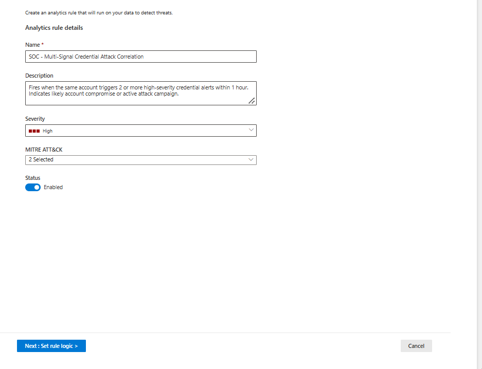
*Figure 2.1: Active enterprise data connectors streaming telemetry into Sentinel.*

---

### Custom Detection Rules Deployed
Engineered two complementary analytic rules to combat credential compromise:

1. **NRT Rule (`SOC - Password Spray Active Attack`):** Sub-minute evaluation of brute force events with dynamic JSON entity parsing.
2. **Scheduled Correlation Rule (`SOC - Multi-Signal Credential Attack Correlation`):** Correlates 6 distinct high-severity alert types occurring on the same account within a 1-hour window.

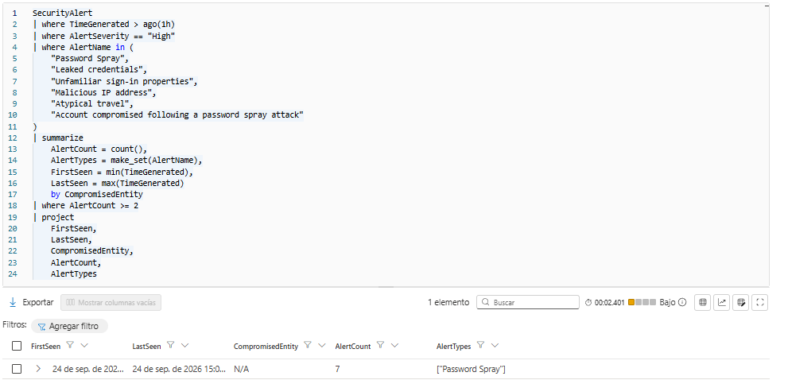
*Figure 2.2: General configuration of the scheduled multi-signal correlation rule.*

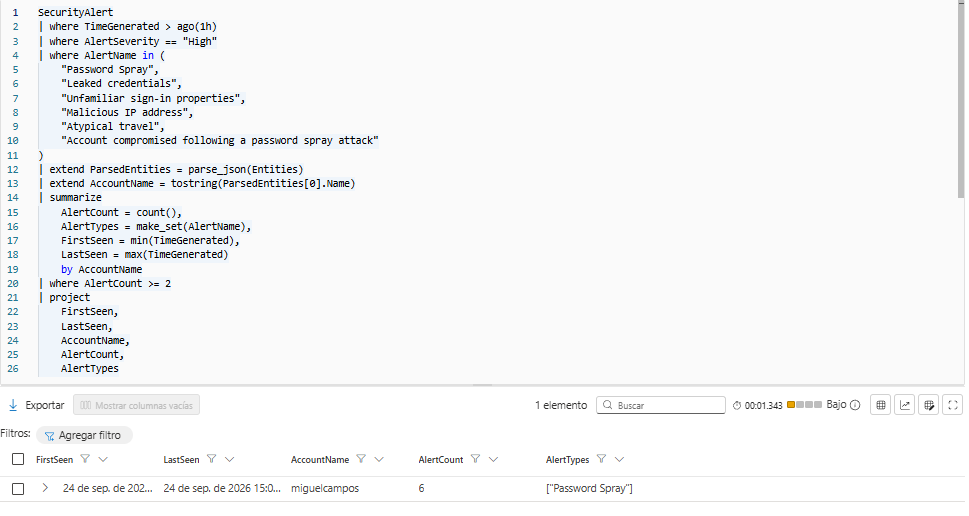
*Figure 2.3: KQL query logic performing temporal aggregation and entity parsing.*

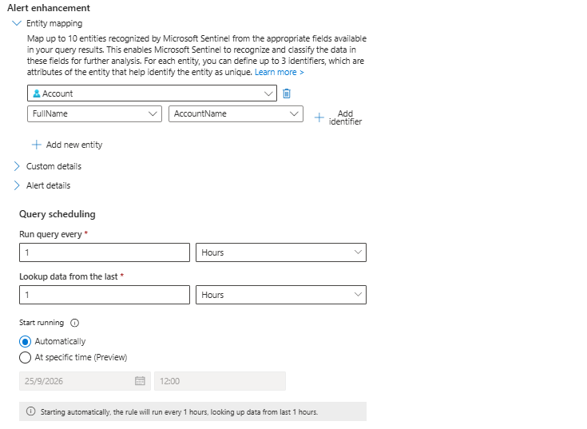
*Figure 2.4: Entity mapping linking target accounts to the Microsoft Sentinel Account entity schema.*

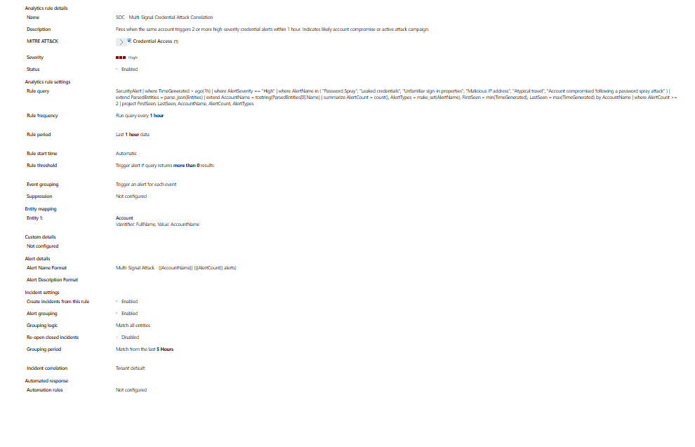
*Figure 2.5: Alert grouping configured for a 5-hour window to eliminate duplicate alert generation.*

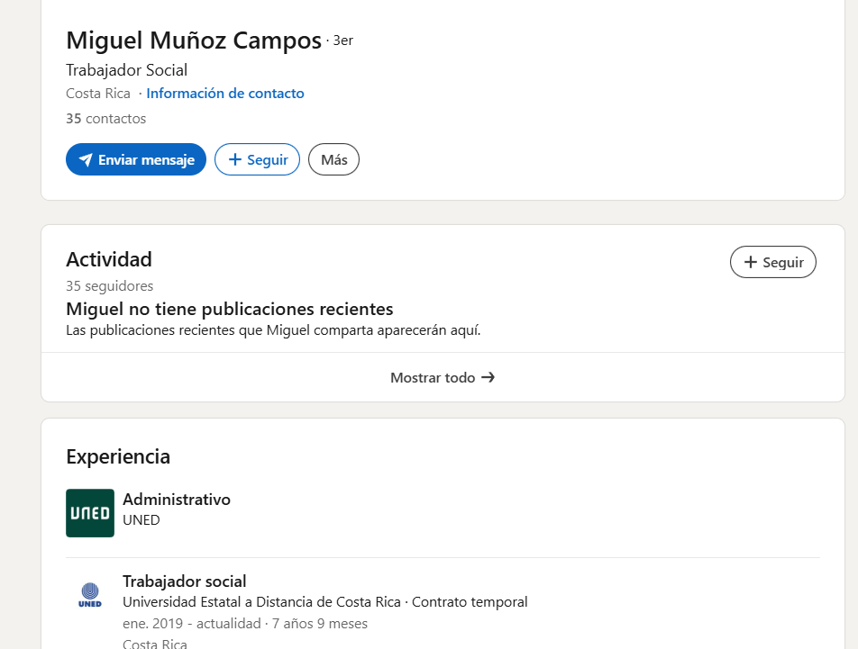
*Figure 2.6: Active custom detection rules deployed and monitoring the workspace.*

---

## 3. SOAR Automation Pipeline (Logic Apps & Managed Identity)

To standardize L1 incident response, an automated triage playbook was constructed following least-privilege identity principles:

1. **Playbook Trigger:** `Microsoft Sentinel incident` trigger preserving correlated incident context.
2. **Managed Identity Authentication:** System-Assigned Managed Identity configured—zero hardcoded API keys or service principal secrets.
3. **RBAC Governance:** Assigned `Microsoft Sentinel Responder` role at resource group scope to permit incident annotation without excessive administrative privileges.
4. **Automation Rule:** Automated rule triggers the playbook on incident creation matching credential compromise detection rules.

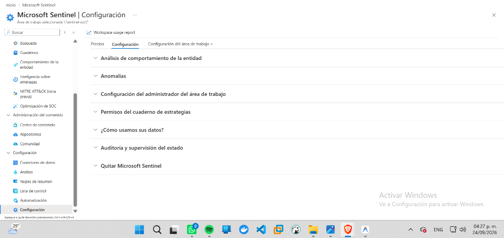
*Figure 2.7: Logic App playbook creation wizard.*

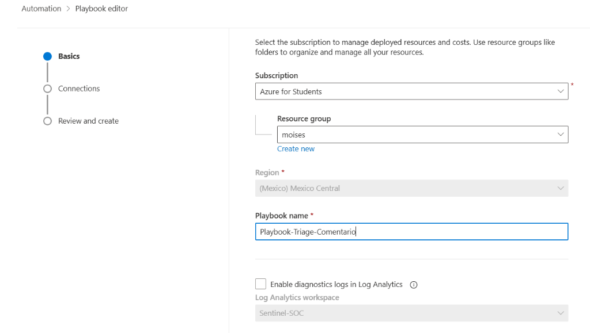
*Figure 2.8: Configuring the Azure Sentinel connector using Managed Identity authentication.*

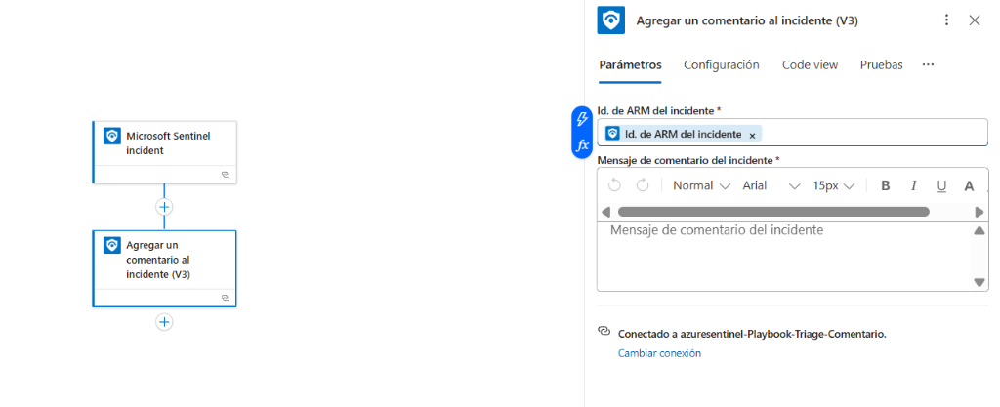
*Figure 2.9: Logic App workflow dynamically mapping Incident ARM ID and injecting standardized triage guidance.*

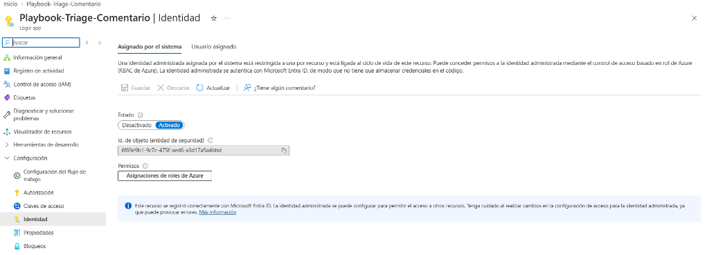
*Figure 2.10: System-assigned Managed Identity enabled for the Logic App.*

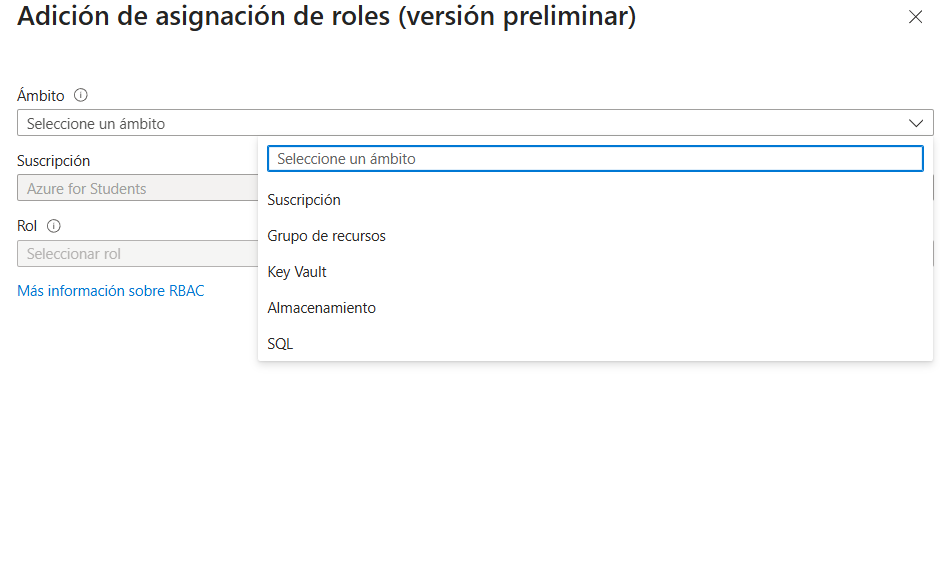
*Figure 2.11: Assigning the "Microsoft Sentinel Responder" Azure RBAC role to the Logic App identity.*

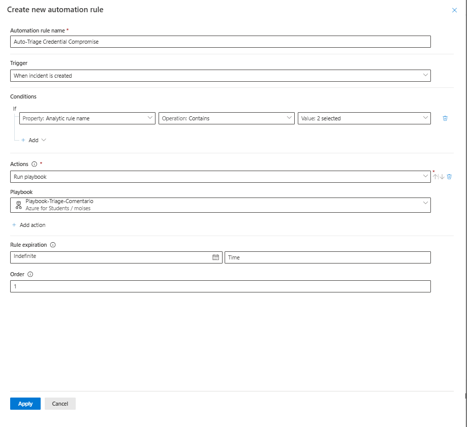
*Figure 2.12: Microsoft Sentinel Automation Rule executing the playbook upon incident creation.*

---

## 4. Threat Hunting & Live Forensic Investigation

### Hunting Query 01: Complete MITRE ATT&CK Kill Chain
Classified all 384 alerts into 6 distinct tactical attack phases. Account identities are SHA-256 hashed for privacy:

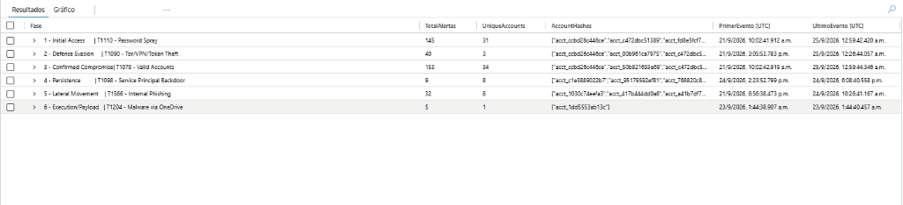
*Figure 2.13: Full multi-phase attack kill chain identified and quantified.*

---

### Hunting Query 02: Attacker Infrastructure & Geolocation
Extracted and ranked attacker IP addresses utilized in the distributed password spray:
* **Primary Spray Node:** `203.57.82.133` (London, United Kingdom — 10 attack bursts)
* **Secondary Spray Node:** `203.17.244.189` (Amsterdam, Netherlands — 9 attack bursts)
* **US Infrastructure:** `167.148.201.149` (Liberty Lake, United States — 8 attack bursts)

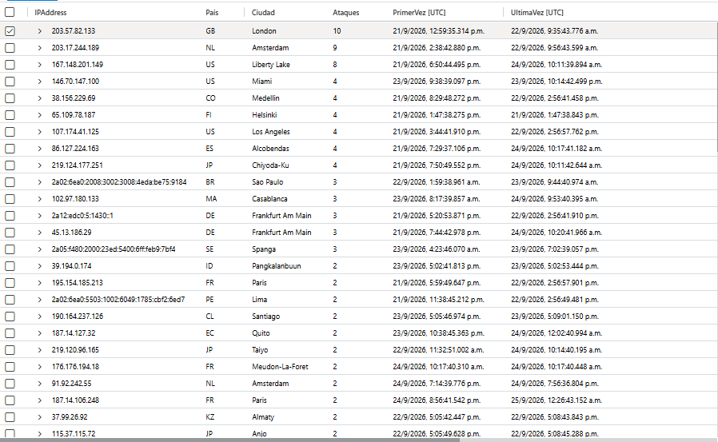
*Figure 2.14: Attacker IP infrastructure extracted from Password Spray telemetry.*

---

### Hunting Query 03: Confirmed Account Compromise (34 Accounts)
Correlated multi-signal alerts (`Atypical travel`, `Unfamiliar sign-in properties`, `Malicious IP sign-in`) confirming successful unauthorized access across 34 distinct accounts:

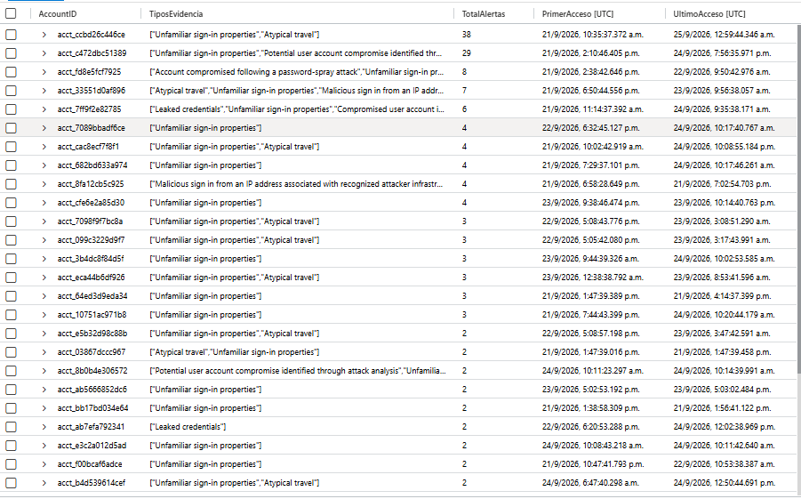
*Figure 2.15: Roster of confirmed compromised accounts ranked by alert density (SHA-256 anonymized).*

---

### Hunting Query 04: Day-0 Service Principal Persistence (T1098)
Discovered an automated script (`User-Agent: Python-urllib/3.11`) operating from IP `98.167.221.41` that compromised 8 accounts on **24 September 2026** (between 14:23 and 18:08 UTC), injecting credentials into Azure AD Enterprise Applications to establish persistent backdoors:

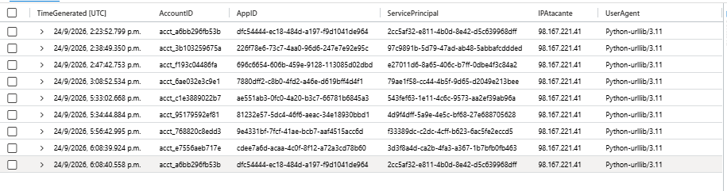
*Figure 2.16: Forensic timeline of automated Service Principal backdoor injection.*

---

### Hunting Query 05: Malware Staging & Internal Lateral Phishing
Uncovered malware uploaded to `Microsoft OneDrive for Business` under an affected account (Defender Incident `#756814`), coupled with 32 user complaints regarding internal phishing emails dispatched from compromised institutional mailboxes:

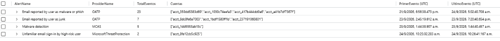
*Figure 2.17: Telemetry showing malware detection in cloud storage and internal phishing reports.*

---

### Hunting Query 06: Campaign Escalation Timeline
Visualized daily progression of each attack phase from initial spray (21 Sept) to automated backdoor injection (24 Sept) and continuing activity:

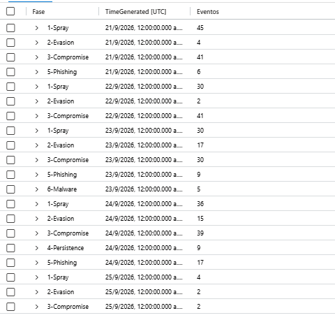
*Figure 2.18: Daily timeline illustrating campaign escalation from initial access to persistence.*

---

### Hunting Query 07: Global Alert Inventory
Inventoried all 30-day security events, validating that the custom detection rules successfully surfaced high-priority incidents above operational background noise:

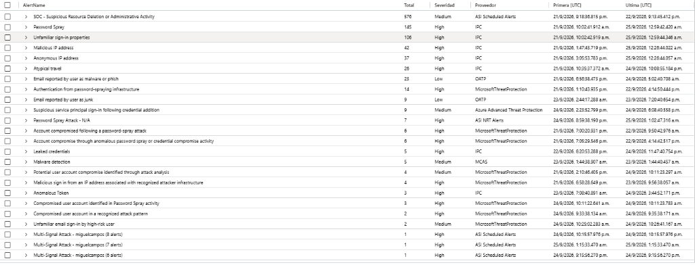
*Figure 2.19: Complete alert inventory across the tenant over a 30-day window.*

---

## 5. Artifacts & Reference Code

* **Detection Rules:** [`detection-rules/`](detection-rules/)
* **Threat Hunting KQL Queries:** [`threat-hunting/`](threat-hunting/)
* **SOAR Documentation:** [`automation/playbook-documentation.md`](automation/playbook-documentation.md)
* **Forensic Report:** [`findings/incident-report-anonymized.md`](findings/incident-report-anonymized.md)
